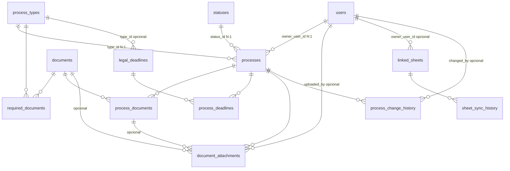

# PGR

Sistema de gestão de processos com backend em **FastAPI** (`backend/`) e frontend em **React + Vite** (`frontend-react/`). Em produção, a aplicação serve a API e os ficheiros estáticos gerados em `frontend-dist/`.

## Stack

- Python 3.11+
- FastAPI
- React + Vite
- SQLite por padrão
- Docker / Docker Compose para produção recomendada

## Estrutura

- `backend/`: API, autenticação, integração com Google, regras de negócio
- `frontend-react/`: interface web
- `deploy/`: `compose.yml` e `Caddyfile` para produção
- `scripts/`: utilitários de arranque e bootstrap
- `start_app.py`: arranque simples da aplicação

## Desenvolvimento local

Requisitos:

- Python 3.11+
- Node.js 20+

Arranque rápido:

```bash
./scripts/pgr.sh local
```

Isto sobe o backend localmente e trata do frontend quando necessário.

URLs:

- App/API: `http://127.0.0.1:8001`
- Frontend Vite em dev separado: `cd frontend-react && npm run dev`

Build manual do frontend:

```bash
./scripts/pgr.sh build-frontend
```

Executar sem reload:

```bash
PORT=8001 ./scripts/pgr.sh serve
```

Equivalente mínimo:

```bash
python start_app.py
```

## Variáveis de ambiente

Copie o ficheiro de exemplo para `.env` na raiz e ajuste os valores do seu ambiente.

Em produção, as variáveis mais importantes são:

- `PORT`: porta do servidor
- `APP_DOMAIN`: domínio público da aplicação
- `WEBHOOK_BASE_URL`: URL base HTTPS usada em integrações/webhooks
- `SECRET_KEY`: segredo principal da aplicação
- `GOOGLE_WEBHOOK_SECRET`: segredo para validação do webhook Google

## Produção recomendada

Para este projeto, a opção mais equilibrada é:

- **VPS**
- **Docker Compose**
- **Caddy**
- **domínio próprio**

Arquivos já preparados:

- `deploy/compose.yml`
- `deploy/Caddyfile`
- `.env.production.example`
- `scripts/bootstrap_vps.sh`

## Deploy rápido na VPS

### 1. Domínio

Pode usar:

- Cloudflare Registrar
- Registro.br
- Namecheap

Crie o domínio e guarde acesso ao painel DNS.

### 2. VPS

Recomendado:

- Hetzner Cloud

Alternativas:

- DigitalOcean
- Vultr

Configuração inicial sugerida:

- Ubuntu 22.04 LTS
- 2 vCPU
- 4 GB RAM
- SSD suficiente para uploads e base de dados

Garanta que as portas `80` e `443` estão liberadas.

### 3. DNS

Crie um registo `A` apontando o domínio ou subdomínio para o IP público da VPS.

Exemplo:

- `app.seudominio.com` -> `IP_DA_VPS`

Teste:

```bash
dig +short app.seudominio.com
```

### 4. Clonar o projeto

```bash
git clone <repo>
cd PGR
```

### 5. Configurar `.env`

```bash
cp .env.production.example .env
```

Preencha pelo menos:

- `APP_DOMAIN`
- `WEBHOOK_BASE_URL`
- `SECRET_KEY`
- `GOOGLE_WEBHOOK_SECRET`

### 6. Subir com Docker Compose

```bash
cd deploy
docker compose up -d --build
```

### 7. Verificar

```bash
cd deploy
docker compose ps
docker compose logs -f
```

Depois aceda a:

- `https://app.seudominio.com`
- `https://app.seudominio.com/docs`

## Deploy automático com bootstrap

Se quiser automatizar a preparação da VPS:

```bash
bash /opt/PGR/scripts/bootstrap_vps.sh \
  --repo https://github.com/SEU_USUARIO/PGR.git \
  --domain app.seudominio.com \
  --secret-key "GERE_UMA_CHAVE_LONGA_E_ALEATORIA" \
  --webhook-secret "GERE_OUTRO_SEGREDO_FORTE"
```

O script:

- instala Docker e Compose
- ajusta firewall
- clona ou atualiza o projeto
- cria `.env`
- sobe os containers

## Produção sem Docker

Se não quiser Docker:

1. Instale Python 3.11 e dependências
2. Faça o build do frontend
3. Sirva a aplicação com `uvicorn` ou `gunicorn`
4. Coloque Nginx na frente para HTTPS e proxy reverso
5. Use `systemd`, `supervisor` ou equivalente para manter o processo ativo

Comandos base:

```bash
pip install -r requirements.txt
cd frontend-react && npm ci && npm run build
export PORT=8001
python start_app.py
```

## Google Drive / Google Sheets

Se usar integração com Google:

1. Crie um projeto no Google Cloud Console
2. Ative as APIs necessárias
3. Crie uma service account
4. Gere o JSON de credenciais
5. Coloque o ficheiro no servidor com permissões restritas
6. Partilhe as planilhas com o email da service account como leitor

As referências de integração estão no código em `backend/webhook_config.py` e serviços relacionados.

## Persistência e backups

Em Docker, os volumes principais são:

- `pgr_data`
- `pgr_uploads`
- `pgr_reports`

Recomendação mínima:

- backup diário
- cópia fora da VPS
- teste de restauração periodicamente

## Modelo de dados e cardinalidades

Referência: `backend/models_sqlalchemy.py` — SQLite por defeito em `data/PGR.db`.

**Legenda**

| Notação | Significado |
|---------|-------------|
| **1** | Um registo do lado “pai” (em sentido lógico da FK). |
| **0..1** | Zero ou um (FK **nullable**). |
| **N** | Zero ou muitos (coleção sem limite superior no modelo). |
| **N:M** | Muitos para muitos, por **tabela associativa** com duas FKs. |

Não há relações **1:1** obrigatórias entre duas entidades principais; predomina **N:1** e **N:M** via junções.

### Relações N:1 (muitos → um)

| De (N) | Para (1) | Cardinalidade | Coluna FK | Nullable |
|--------|----------|----------------|-----------|----------|
| `processes` | `users` | **N:1** | `owner_user_id` | sim |
| `processes` | `process_types` | **N:1** | `type_id` | sim |
| `processes` | `statuses` | **N:1** | `status_id` | sim |
| `required_documents` | `process_types` | **N:1** | `type_id` | não |
| `required_documents` | `documents` | **N:1** | `document_id` | não |
| `process_documents` | `processes` | **N:1** | `process_id` | não |
| `process_documents` | `documents` | **N:1** | `document_id` | não |
| `legal_deadlines` | `process_types` | **N:1** | `type_id` | sim (`NULL` = prazo geral) |
| `process_deadlines` | `processes` | **N:1** | `process_id` | não |
| `process_deadlines` | `legal_deadlines` | **N:1** | `legal_deadline_id` | não |
| `document_attachments` | `processes` | **N:1** | `process_id` | não |
| `document_attachments` | `documents` | **N:1** | `document_id` | sim |
| `document_attachments` | `process_documents` | **N:1** | `process_document_id` | sim |
| `document_attachments` | `users` | **N:1** | `uploaded_by` | sim |
| `linked_sheets` | `users` | **N:1** | `owner_user_id` | sim |
| `sheet_sync_history` | `linked_sheets` | **N:1** | `linked_sheet_id` | não |
| `process_change_history` | `processes` | **N:1** | `process_id` | não |
| `process_change_history` | `users` | **N:1** | `changed_by_user_id` | sim |

### Relações N:M (tabelas associativas)

| Entidade A | Entidade B | Tabela | Observação |
|------------|------------|--------|------------|
| `process_types` | `documents` | `required_documents` | Documentos exigidos por tipo (`required`, `doc_order`). |
| `processes` | `documents` | `process_documents` | Checklist por processo (`provided`, datas, etc.). |

### Sentido inverso (1 → N)

| Um registo em… | Para… | Cardinalidade |
|----------------|-------|----------------|
| `users` | `processes` (dono) | **1:N** |
| `users` | `linked_sheets` | **1:N** (FK em `linked_sheets`; sem `relationship` em `User`) |
| `users` | `document_attachments` (quem enviou) | **1:N** |
| `users` | `process_change_history` (autor) | **1:N** |
| `process_types` | `processes`, `required_documents`, `legal_deadlines` | **1:N** |
| `statuses` | `processes` | **1:N** |
| `documents` | `required_documents`, `process_documents`, `document_attachments` | **1:N** |
| `processes` | `process_documents`, `process_deadlines`, `document_attachments`, `process_change_history` | **1:N** |
| `legal_deadlines` | `process_deadlines` | **1:N** |
| `linked_sheets` | `sheet_sync_history` | **1:N** |

### Diagrama ER (Mermaid)



- `||--o{` indica um pai e zero ou muitos filhos; FKs nullable implicam **0..1** no lado referenciado quando não preenchidas.

### Restrições úteis

- `linked_sheets.file_id` é **único** (um registo por ficheiro Google ligado).
- `users.username` e `users.email` são **únicos**.

Diagramas de arquitetura (fluxogramas, pyreverse): `docs/diagrams/FLOWCHARTS.md`.

## Atualização de versão

Na VPS:

```bash
cd /opt/PGR
git pull
cd deploy
docker compose up -d --build
```

## Operação e checklist

Antes de entregar para clientes:

- configurar `.env` com segredos reais
- validar domínio e HTTPS
- testar login
- testar importação de planilha
- testar relatórios
- testar calendário
- testar integração Google, se aplicável
- configurar backups
- restringir CORS em produção

## Scripts úteis

- `./scripts/pgr.sh local`
- `./scripts/pgr.sh build-frontend`
- `./scripts/pgr.sh serve`
- `./scripts/pgr.sh tunnel [porta]`
- `./scripts/pgr.sh help`

## Notas

- O primeiro utilizador pode assumir papel administrativo conforme a lógica atual da aplicação.
- O padrão atual de base de dados é SQLite em `data/`.
- Se migrar para PostgreSQL ou outro banco, ajuste a configuração no backend conforme o ambiente.
