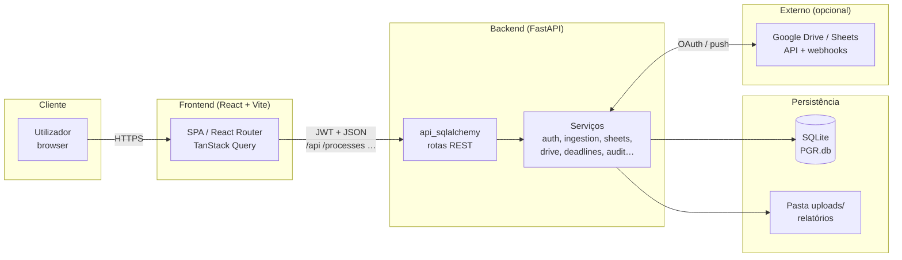
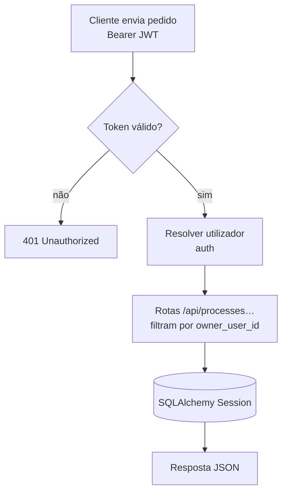
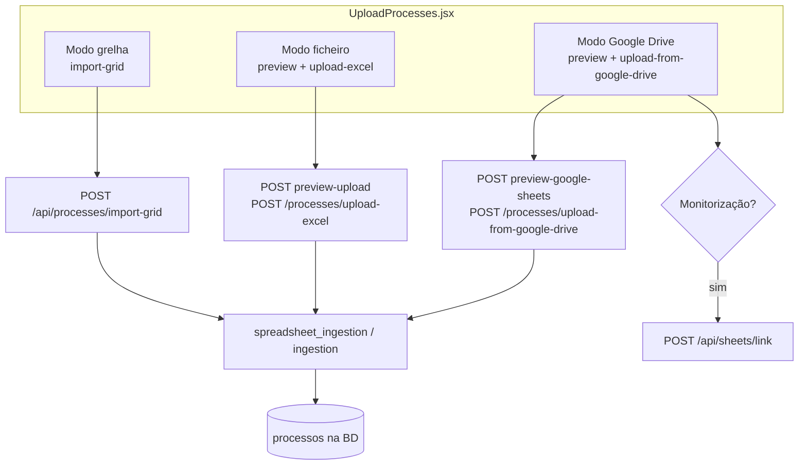
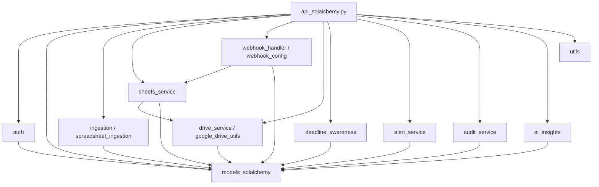
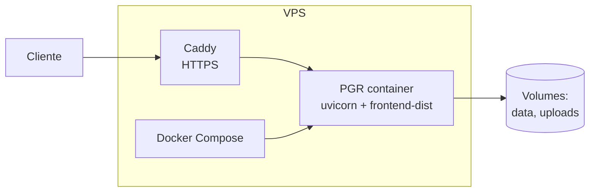
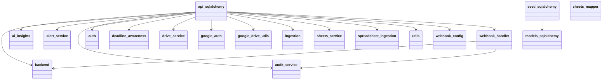

# Fluxogramas PGR — Mermaid, diagrams e pyreverse

Este diretório concentra **três formas** de visualizar o projeto. São **6 fluxogramas PNG** (2 por ferramenta):

| # | Ferramenta | Ficheiro PNG | Origem |
|---|------------|--------------|--------|
| 1 | **diagrams** | `pgr_fluxo_geral.png` | `python3 architecture_diagrams.py` (função `build_general`) |
| 2 | **diagrams** | `pgr_fluxo_detalhado.png` | idem (`build_detailed`) |
| 3 | **Mermaid** | `mermaid_fluxo_geral.png` | `mermaid/mermaid_fluxo_geral.mmd` → `mmdc` |
| 4 | **Mermaid** | `mermaid_fluxo_detalhado.png` | `mermaid/mermaid_fluxo_detalhado.mmd` → `mmdc` |
| 5 | **pyreverse** | `pyreverse_pacotes.png` | `pyreverse_output/packages_pgr_backend.dot` → `dot -Tpng` |
| 6 | **pyreverse** | `pyreverse_classes.png` | `pyreverse_output/classes_pgr_backend.dot` → `dot -Tpng` |

Além disto: texto Mermaid embebido neste `.md`; fontes `.mmd`/`.dot` em `mermaid/` e `pyreverse_output/`.

**Regenerar os PNG Mermaid** (Node 18+; se Puppeteer falhar por sandbox Linux, usa-se `mermaid/puppeteer-config.json`):

```bash
cd docs/diagrams
npx --yes @mermaid-js/mermaid-cli@10.9.1 -p mermaid/puppeteer-config.json \
  -i mermaid/mermaid_fluxo_geral.mmd -o mermaid_fluxo_geral.png -b white -w 1200
npx --yes @mermaid-js/mermaid-cli@10.9.1 -p mermaid/puppeteer-config.json \
  -i mermaid/mermaid_fluxo_detalhado.mmd -o mermaid_fluxo_detalhado.png -b white -w 1400 -H 1600
```

---

## 1. Fluxograma geral (Mermaid)

Visão macro: utilizador, frontend, API, dados e integração opcional com Google.



---

## 2. Fluxograma detalhado (Mermaid)

### 2.1 Rotas da aplicação React

```mermaid
flowchart TB
  subgraph App["App.jsx"]
    RQ[QueryClientProvider]
    AUTH[AuthProvider]
    ROUTER[BrowserRouter]
  end

  LOGIN[/login]
  PROT["ProtectedRoute + MainLayout"]

  DASH[/dashboard]
  PERF[/performance]
  PROC["/process/:protocol"]
  UP[/upload]
  LINK[/linked-sheets]
  REP[/reports]
  CAL[/calendar]
  SET[/settings]

  ROUTER --> LOGIN
  ROUTER --> PROT
  PROT --> DASH & PERF & PROC & UP & LINK & REP & CAL & SET
```

### 2.2 Fluxo de pedido autenticado (multi-tenant)



### 2.3 Importação de processos (resumo)



### 2.4 Backend: módulos que alimentam a API (visão lógica)



### 2.5 Deploy Docker (referência)



---

## 3. pyreverse — diagramas UML do pacote `backend`

Geração dos fontes **`.mmd`** e **`.dot`** (sem Graphviz). Para os PNG **`pyreverse_pacotes.png`** e **`pyreverse_classes.png`**, use o comando **`dot`** (pacote `graphviz` no sistema ou via conda):

```bash
cd docs/diagrams
dot -Tpng -Gdpi=120 pyreverse_output/packages_pgr_backend.dot -o pyreverse_pacotes.png
dot -Tpng -Gdpi=100 pyreverse_output/classes_pgr_backend.dot -o pyreverse_classes.png
```

Para regenerar só os fontes:

```bash
cd /path/to/PGR
mkdir -p docs/diagrams/pyreverse_output
pyreverse -o mmd -p pgr_backend backend -d docs/diagrams/pyreverse_output
pyreverse -o dot -p pgr_backend backend -d docs/diagrams/pyreverse_output
```

---

## 4. diagrams (Python) — arquitetura em PNG

**Dependências:** `pip install diagrams` e **Graphviz no sistema** (ex.: `sudo apt install graphviz` — o comando `dot` tem de existir no `PATH`).

```bash
cd docs/diagrams
pip install diagrams
python3 architecture_diagrams.py
```

Saída esperada no mesmo diretório:

- `pgr_fluxo_geral.png`
- `pgr_fluxo_detalhado.png`

Lista opcional de dependências só para diagramas: ver `requirements-diagrams.txt`.

---

## 5. Exemplo: diagrama de pacotes gerado por pyreverse

O ficheiro completo está em `pyreverse_output/packages_pgr_backend.mmd`. Segue uma cópia para pré-visualização rápida:


